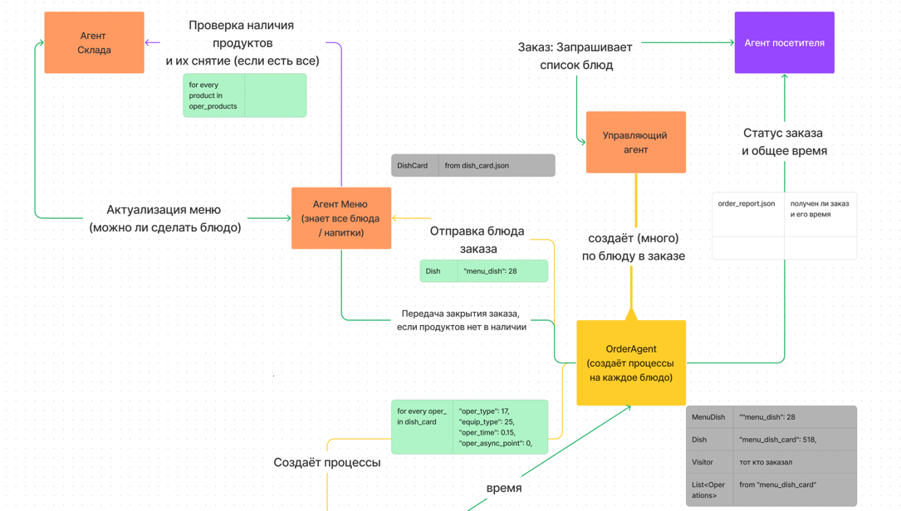
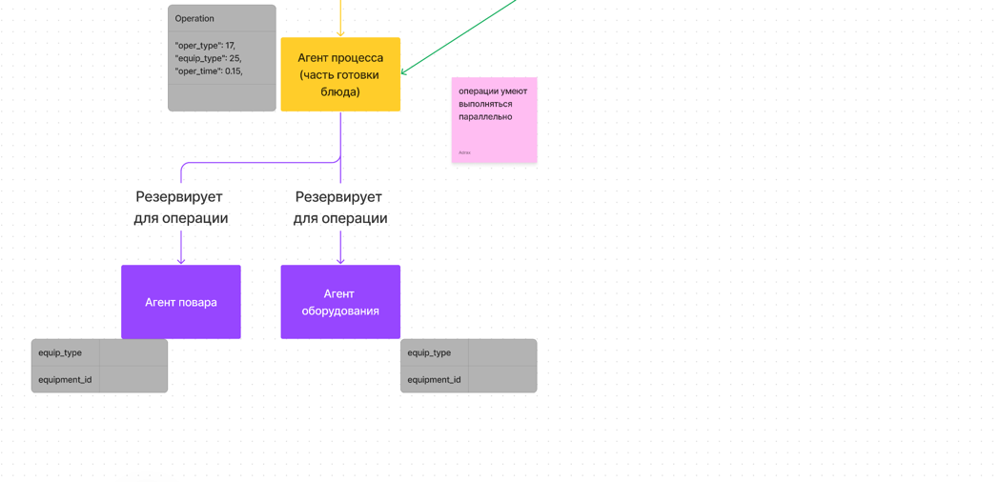

# MAS на Jade
## Конструирование Программного обеспечения. ДЗ № 3.
## Выполнили Киселев Иван БПИ217 и Митюшкин Максим БПИ216 (Посещает занятия с 217 группой, https://github.com/Kotlinovsky).

### Описание программы:
Программа использует фреймворк jade, библеотека находится в папке libs

На изображениях обозначена схема работы приложения

Названия агентов:

- Агент посетителя - VisitorAgent
- Управляющйи агент - ManagerAgent
- Агент меню - MenuAgent
- Агент склада - StockAgent
- Агент приготовления блюда - OrderAgent
- Агент процесса - ProcessAgent

Работа приложения моделирует работу ресторана

Реализовано:

- Корректная ООП-реализация программы в виде МАС (на фреймворке Jade)
- Поддержа парралелизма в процессах.
- Присутсвует оценка времени ожидания заказов
- Есть проверка корректности входных данных
- Паттерны МАС применаются корректно, не создаются лишнии агенты, присутсвует декомпозиция в коде, код спроектирован с небольшим количеством зависимостей (в т.ч из-за преимущества архитектуры МАС)
- Реализация МАС на платформе Jade (с использованием онтологий).

  Mas.jar работает с 19 джавой

> Логи:
> outputs/process_log.json лог приготовления блюда (OrderAgent)
> outputs/operation_log.json лог процессов (операций по приготовлению) (ProcessAgent)

> *ID процесса (OrderAgent) и операции (ProcessAgent) получаем хэшированием уникального имени агента

В полях "oper_time": 0.15, мы считаем, что указаны минуты. Время в модели идет в 50 раз быстрее реального.

! Все операции начинают работу с момента создания заказа, который их содержит (т.е с момента поступления заказа)

